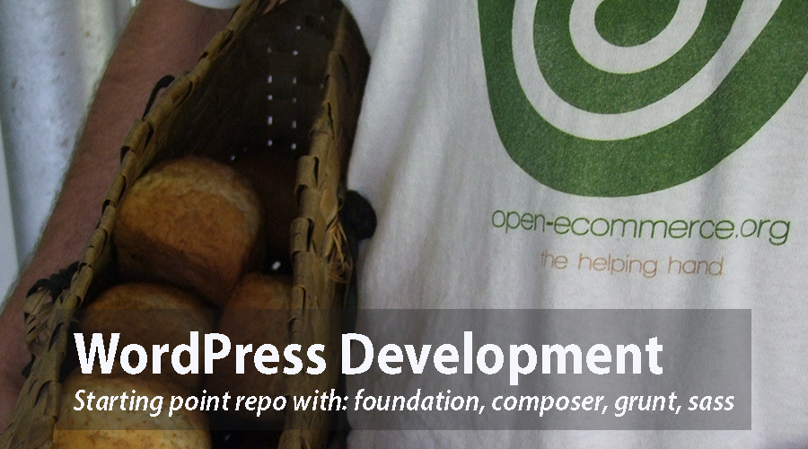

# WordPress Starting base template
This is the repository integrating some other repos about adding composer to wp and integrating foundation to a wp theme with the idea of simplify the starting process.
Later on you can select the wp plugins you want to have changing the composer.json file but this are the plugins we are using:


##You can see a demo at:
http://wp-brixton.oe-lab.tk/


##We are using the following repos with the real hard work:
for composer install
https://github.com/roots/bedrock
that uses:
https://github.com/johnpbloch/wordpress-core-installer
to use plugins as vendors
and
https://github.com/vlucas/phpdotenv
to have the beautiful .env configuration


##for the foundation theme that we call oe-brixton, the amazing work of Ole Fredrik Lie.
we are using the code instead of forking to have our own configuration but I will recommend to take the latest version from the Ole's repo.
https://github.com/olefredrik/foundationpress

##for the bootstrap theme that we call oe-kennington, the amazing work of Per Thykjaer Jensen.
we are using the code instead of forking to have our own implementation but I will recomment to clone the lates version from this repo.
https://github.com/asathoor/maat-or-the-improved-bootstrap


##You can see some in progress documentation once you finish with the installation
https://github.com/open-ecommerce/masters-wp/blob/master/docs/working-on-it.md


#How to install and eventualy deploy :)

## Installation

1. Create a new project in a new folder for your project:

  `composer create-project open-ecommerce/masters-wp your-project-folder-name`

2. Copy `.env.example` to `.env` and update environment variables:
  * `DB_NAME` - Database name
  * `DB_USER` - Database user
  * `DB_PASSWORD` - Database password
  * `DB_HOST` - Database host
  * `WP_ENV` - Set to environment (`development`, `staging`, `production`)
  * `WP_HOME` - Full URL to WordPress home (http://example.com)
  * `WP_SITEURL` - Full URL to WordPress including subdirectory (http://example.com/wp)
  * `AUTH_KEY`, `SECURE_AUTH_KEY`, `LOGGED_IN_KEY`, `NONCE_KEY`, `AUTH_SALT`, `SECURE_AUTH_SALT`, `LOGGED_IN_SALT`, `NONCE_SALT`

  If you want to automatically generate the security keys (assuming you have wp-cli installed locally) you can use the very handy [wp-cli-dotenv-command][wp-cli-dotenv]:

      wp package install aaemnnosttv/wp-cli-dotenv-command

      wp dotenv salts regenerate

  Or, you can cut and paste from the [Roots WordPress Salt Generator][roots-wp-salt].

3. Add theme(s) in `web/app/themes` as you would for a normal WordPress site.

4. Set your site vhost document root to `/path/to/site/web/` (`/path/to/site/current/web/` if using deploys)

5. Access WP admin at `http://example.com/wp/wp-admin`

## Setup your webserver
Now you should point your url to the web folder of the new project.

###If you are using Apache
You can create a new file call 'example_dev.conf' in your /etc/apache2/sites-available folder with something like this:
```
  <VirtualHost *:80>
      ServerAdmin whatevername@whatever.org
      ServerName example.dev
      ServerAlias www.example.dev
      DocumentRoot /var/www/example/web
      ErrorLog ${APACHE_LOG_DIR}/example_error.log
      CustomLog ${APACHE_LOG_DIR}/example_access.log combined
  </VirtualHost>
```

Then of course:
Add the url to your host file: `/etc/hosts`
`127.0.1.1       example.dev`

Make apache recognize the config file:
`sudo a2ensite example_dev.conf`

And reload apache
`sudo service apache2 reload`

###If you are using Ngnx
you can create a new configuration file at `/etc/nginx/` can be something like that:

```
server {
    charset utf-8;
    client_max_body_size 128M;

    listen 80; ## listen for ipv4
    #listen [::]:80 default_server ipv6only=on; ## listen for ipv6

    server_name example.dev;
    root        /var/www/example/web;
    index       index.php;

    access_log  /path/to/basic/log/example_access.log;
    error_log   /path/to/basic/log/example_error.log;

    location / {
        # Redirect everything that isn't a real file to index.php
        try_files $uri $uri/ /index.php$is_args$args;
    }

    location ~ \.php$ {
        include fastcgi_params;
        fastcgi_param SCRIPT_FILENAME $document_root$fastcgi_script_name;
        fastcgi_pass 127.0.0.1:9000;
        #fastcgi_pass unix:/var/run/php5-fpm.sock;
        try_files $uri =404;
    }

    location ~* /\. {
        deny all;
    }
}
```

Then restart nginx
`service nginx reload`

---

Then remember to add the url to your host file: `/etc/hosts`
`127.0.1.1       example.dev`


## Deploys

There are two methods to deploy Bedrock sites out of the box:

* [Trellis](https://github.com/roots/trellis)
* [bedrock-capistrano](https://github.com/roots/bedrock-capistrano)

Any other deployment method can be used as well with one requirement:

`composer install` must be run as part of the deploy process.

## Documentation

Bedrock documentation is available at [https://roots.io/bedrock/docs/](https://roots.io/bedrock/docs/).


## About oe-brixton theme
As I said it is forked from Fredrik repo: https://github.com/olefredrik/foundationpress

This is a starter-theme for WordPress based on Foundation 6, the most advanced responsive (mobile-first) framework in the world. The purpose of FoundationPress, is to act as a small and handy toolbox that contains the essentials needed to build any design. FoundationPress is meant to be a starting point, not the final product.


## Requirements
**This project requires [Node.js](http://nodejs.org) v4.x.x to v6.9.x to be installed on your machine.** Please be aware that you will most likely encounter problems with the installation if you are using v7.1.0 with all the latest features.

FoundationPress uses [Sass](http://Sass-lang.com/) (CSS with superpowers). In short, Sass is a CSS pre-processor that allows you to write styles more effectively and tidy.

The Sass is compiled using libsass, which requires the GCC to be installed on your machine. Windows users can install it through [MinGW](http://www.mingw.org/), and Mac users can install it through the [Xcode Command-line Tools](http://osxdaily.com/2014/02/12/install-command-line-tools-mac-os-x/).

If you have not worked with a Sass-based workflow before, I would recommend reading [FoundationPress for beginners](https://foundationpress.olefredrik.com/posts/tutorials/foundationpress-for-beginners), a short blog post that explains what you need to know.

## Quickstart

### 1. Clone the repository and install with npm
```bash
$ cd web/app/themes/oe-brixton
$ npm install
```

### 2. While you're working on your project, run:

```bash
$ npm run watch
```

If you want to take advantage of browser-sync (automatic browser refresh when a file is saved), simply open your Gulpfile.js and put your local dev-server address (e.g localhost) in this field ```var URL = '';``` , save the Gulpfile and run
```bash
$ npm run watch
```

### 3. For building all the assets, run:

```bash
$ npm run build
```

Build all assets minified and without sourcemaps:
```bash
$ npm run production
```

### 4. To create a .zip file of your theme, run:

```bash
$ npm run package
```

Running this command will build and minify the theme's assets and place a `.zip` archive of the theme in the `packaged` directory. This excludes the developer files/directories from your theme like `node_modules`, `assets/components`, etc. to keep the theme lightweight for transferring the theme to a staging or production server.

### Styles

 * `style.css`: Do not worry about this file. (For some reason) it's required by WordPress. All styling are handled in the Sass files described below

 * `assets/scss/foundation.scss`: Make imports for all your styles here
 * `assets/scss/global/*.scss`: Global settings
 * `assets/scss/components/*.scss`: Buttons etc.
 * `assets/scss/modules/*.scss`: Topbar, footer etc.
 * `assets/scss/templates/*.scss`: Page template spesific styling

Please note that you **must** run `npm run build` or `npm run watch` in your terminal for the styles to be copied and concatenated. See the [Gulpfile.js](https://github.com/olefredrik/FoundationPress/blob/master/gulpfile.js) for details

### Scripts

* `assets/javascript/custom`: This is the folder where you put all your custom scripts. Every .js file you put in this directory will be minified and concatenated one single .js file. (This is good for site speed and performance)

Please note that you must run `npm run build` or `npm run watch` in your terminal for the scripts to be copied and concatenated. See [Gulpfile.js](https://github.com/olefredrik/FoundationPress/blob/master/gulpfile.js) for details

### The main styles and scripts generated by the build

Version control on these files are turned off because they are automatically generated as part of the build process.

* `assets/stylesheets/foundation.css`: All Sass files are minified and compiled to this file
* `assets/stylesheets/foundation.css.map`: CSS source maps

* `assets/javascript/vendor`: Vendor scripts are copied from `assets/components/` to this directory. We use this path for enqueing the vendor scripts in WordPress.

### Check For WordPress Coding Standards

Foundation comes with everything you need to run tests that will check your theme for WordPress Coding Standards. To enable this feature you'll need to install PHP Codesniffer, along with the WordPress Coding Standards set of "Sniffs". You'll need to have [Composer](https://getcomposer.org/) To install both run the following:
```bash
$ composer create-project wp-coding-standards/wpcs:dev-master --no-dev
```
When prompted to remove existing VCS, answer Yes by typing `Y`.

Once you have installed the packages, you can check your entire theme by running:
```bash
$ npm run phpcs
```

If there are errors that Code Sniffer can fix automatically, run the following command to fix them:
```bash
$ npm run phpcbf
```


## About oe-kennington theme
As I said it is forked from Fredrik repo: https://raw.githubusercontent.com/asathoor/maat-or-the-improved-bootstrap


# The Maat Theme

Maat is an introduction to WordPress Themes and Nodejs workflows.
The theme is inspried by several speakers at the *WordCamp in Aarhus 2016*.
They mentioned tools such as SASS, Bower, Grunt and Eslint.

* SASS
* Bower

The theme includes several libraries, such as:

* Bootstrap
* Jquery

The Bower files are ignored via .gitignore. Install them this way:

~~~~
# 1) Install Nodejs depencencies
npm install

# 2) Install Bower dependencies
bower install
~~~~

## Idea

The general idea is to create a basic skeleton files for further theme developments.


## Prerequisites
You will need WP-CLI installed in your box with a lamp (mysql, apache, php etc)

Installing cli in your system:
```
curl -O https://raw.githubusercontent.com/wp-cli/builds/gh-pages/phar/wp-cli.phar
```
other options
```
php -r "readfile('https://raw.githubusercontent.com/wp-cli/builds/gh-pages/phar/wp-cli.phar');" > wp-cli.phar
```

If you can't run curl in your shared server just download wp-cli.phar and upload the file using ftp

Then, you need to make the file executable:
```
chmod +x wp-cli.phar
```

The final step is to move the file to a folder, so that you can execute it from anywhere. Renaming the file to something easy to remember and type is also a good idea; this is the reason why wp is the most commonly used name:
```
sudo mv wp-cli.phar /usr/local/bin/wp
wp --info
```

## Instructions to make the wordpress work in your dev box
### clone the master branch of this repo
```
git clone https://github.com/open-ecommerce/masters-wp.git
```
(or to the ssh address if you have a sshkey)

### navigate to the htdocs forder inside master-wp
```
cd masters-wp/htdocs
```

### get latest version of wp for your locale
(choose your locale from this site: http://wpcentral.io/internationalization/)
```
wp core download --locale=en_GB
```

### install wp for your db credentials
(change 'mynewwpdb' with the name of db you want create in the mysql server and your own credentials)
```
wp core config --dbname=mynewwpdb --dbuser=root --dbpass=123 --dbhost=localhost --dbprefix=oe34_
```

### create the db based in the just created wp-config (only if you haven't created the db manualy)
```
wp db create
```

### install and configure wp
- change 'myurl.dev' with the url you want to use localy.
- title is just the title inside the wp config
- change the wp admin credentials
- check more options at WP-CLI documentation: http://wp-cli.org/commands/core/install/
```
wp core install --url=myurl.dev  --title="Open-ecommerce wp master" --admin_user=oeadmin --admin_password=Password123
--admin_email="info@open-ecommerce.org"
```

### install the plugins via composer
- you can edit the composer.json file to add the pugins you want to install
- the wp plugins can be find at: http://wpackagist.org/
```
composer install
```
We added: "config": { "secure-http": false } in the composer.json, to avoid problems getting http repositories in some shared servers.

### activate all plugins using wp-cli
- you can go now to the admin and activate the wordprss you want or you can activate all the just composer installed plugins with this wp-cli command
```
wp plugin activate --all
```

### install test unit demo data
- we are using the wptest repo of Michael Novotny that it is very cool to test themes.
- check more options at WP-CLI documentation: https://github.com/manovotny/wptest

you can pull the latest version from the repo with curl:
```
curl -OL https://raw.githubusercontent.com/manovotny/wptest/master/wptest.xml
```
or with php readfile:
```
php -r "readfile('https://raw.githubusercontent.com/manovotny/wptest/master/wptest.xml');" > wptest.xml
```
I added also our version of the wptest call oe-dumy-sample into this repo just go to to the wp folder and import all with wp
```
wp import wptest.xml --authors=create
```
or
```
wp import oe-dummy-sample.xml --authors=create
```

and then delete the file
```
rm wptest.xml
```


### add the domain to your dev box
- if you are in ubuntu you can use the file manager to do that: `sudo nautilus`
- copy the /docs/myurl.dev.conf to etc/apache2/sites-available and change the domain
- `sudo a2ensite myurl.dev.conf`
- add the domain to your /etc/hosts file

### at this point you should be having a wp installed and configured
- navigate to the myurl.dev/wp-login
- user: oeadmin
- pass: Password123

### next step is to build the wp foundation theme you can check the full doc in the foundationPress repo but a quick reminder
- navigate into the themes folder /wp-content/themes/oewp
- run `npm install` (will install all the grunt modules)
- run 'grunt' to watch the theme folder and compile all grunt tasks when you change the sass files


### While you're working on your project, run:

```bash
$ npm run watch
```


### 3. For building all the assets, run:

```bash
$ npm run build
```

### Build all assets minified and without sourcemaps:
```bash
$ npm run production
```


### about .htaccess files
- we are using this htaccess boilerplate from Bob Elison's gist at: https://gist.github.com/wycks/3011895
- you will need to tweak it depending on the modules you have installed in your server (if you using apache at all...)
